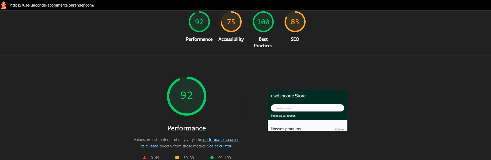

# Mini E-commerce

Este projeto é um mini e-commerce funcional desenvolvido como parte do desafio técnico para uma vaga de Desenvolvedor Frontend Júnior.

O objetivo foi construir uma aplicação completa, priorizando organização de código, componentização, lógica de carrinho, responsividade e comunicação técnica.

## Links

**Deploy:** [Clique aqui](https://use-unconde-ecommerce.onrender.com/)

**Repositório:** [Clique aqui](https://github.com/felipedev90/use-unconde-ecommerce.git)

## Tecnologias utilizadas

- React (Vite)
- Tailwind CSS
- React Router
- Context API (gerenciamento de estado do carrinho)
- Node.js + Express (API)
- LocalStorage (persistência do carrinho)

## Por que escolhi essa stack?

- Vite + React: setup rápido, leve e moderno para SPAs.
- Context API: solução nativa e suficiente para o escopo do carrinho, evitando dependências externas.
- Tailwind CSS: facilita consistência visual, responsividade e manutenção.
- Express: API simples e confiável para servir os dados do products.json, funcionando bem tanto localmente quanto em produção.

## Estrutura de pastas

```bash
src/
├─ components/ # Componentes reutilizáveis (Header, Cart, MiniCart, etc.)
├─ context/ # CartContext, CartProvider e hook useCart
├─ pages/ # Páginas (Home, Product)
├─ hooks/ # Hooks customizados para lógica de dados e derivados (busca, filtro, categorias, fetch)
├─ services/ # Camada de acesso à API (fetch de produtos) e integração externa
├─ utils/ # Funções utilitárias (ex: formatCurrency)
├─ App.jsx
└─ main.jsx

server/
└─ products.json # Dados dos produtos

server.cjs # Servidor Express (API + SPA fallback)
```

#### **Funcionalidades**

```md
## Funcionalidades implementadas

### Produtos

- Listagem de produtos com imagem, nome, categoria e preço
- Página de detalhes do produto
- Filtro por categoria (ordenado alfabeticamente)
- Busca por nome

### Carrinho

- Adicionar produto ao carrinho
- Incrementar e decrementar quantidade
- Remover item individual
- Total atualizado em tempo real
- Persistência com LocalStorage
- MiniCarrinho em formato de drawer/sidebar
- Feedback visual ao adicionar itens

### UI / UX

- Layout mobile-first
- Header adaptado para desktop e mobile
- Ícones SVG
- Microinterações (hover, cursor, feedback visual)
- Tipografia customizada com fontes locais
```

## API

A API lê os dados diretamente do arquivo products.json e expõe os endpoints:

- GET /api/products → lista todos os produtos
- GET /api/products/:id → retorna um produto específico

A API e o front-end são servidos pelo mesmo servidor, evitando problemas de CORS e facilitando o deploy.

## Como rodar o projeto localmente

_Pré-requisitos_

- Node.js (v18+ recomendado)
- npm

Passos:

# instalar dependências

```bash
npm install
```

# build do front-end

```bash
npm run build
```

# iniciar servidor (API + front)

```bash
npm start
```

A aplicação ficará disponível em:

http://localhost:3000

## Responsividade

O projeto foi desenvolvido com abordagem mobile-first, garantindo boa usabilidade em:

- Mobile: 375px
- Desktop: 1440px

No mobile, a busca e o filtro são exibidos abaixo do header para manter clareza visual.

## Diferenciais

- Context API bem isolado (sem prop drilling)
- Persistência de estado do carrinho
- Componentização clara
- Organização de commits
- Feedback visual em ações do usuário
- SPA com fallback correto no servidor (React Router em produção)

## Decisões técnicas relevantes

O carrinho foi centralizado em um Context Provider, mantendo a lógica desacoplada da UI.

A confirmação de remoção de itens foi tratada na camada de interface (MiniCart), preservando a responsabilidade do Context.

A API foi implementada em Express para maior controle no deploy, em vez de depender diretamente do JSON Server em produção.

## Testes

Não foram implementados testes unitários ou E2E neste projeto devido ao escopo e ao prazo do desafio.

A estrutura foi organizada de forma a facilitar a adição futura de testes, especialmente para:

- lógica do carrinho (Context API);
- funções utilitárias;
- fluxos principais do usuário (adicionar/remover itens).

## Uso de IA

Utilizei IA (ChatGPT) como apoio durante o desenvolvimento, principalmente para:

- troubleshooting e correção de erros (ex.: rotas de fallback para SPA em produção, ajustes de build/deploy);
- revisão de abordagem e arquitetura (ex.: migração do carrinho para Context API);
- dúvidas pontuais de implementação e boas práticas.

Além da IA, utilizei amplamente:

- Documentação do React;
- MDN Web Docs;
- Documentação do Tailwind CSS;
- Pesquisas pontuais no Google.

Todas as decisões técnicas, implementações, testes e ajustes finais foram realizadas por mim. As ferramentas citadas foram utilizadas como suporte ao processo de aprendizado e desenvolvimento.

**Desenvolvido por:**
Felipe Augusto

---

## 🚀 Otimização de Performance Web

### Comparativo Antes/Depois

| Categoria      | Antes  | Depois | Melhoria       |
| -------------- | ------ | ------ | -------------- |
| Performance    | 🟢 92  | 🟢 98  | **+6 pontos**  |
| Accessibility  | 🟠 75  | 🟠 89  | **+14 pontos** |
| Best Practices | 🟢 100 | 🟢 100 | manteve        |
| SEO            | 🟠 83  | 🟢 92  | **+9 pontos**  |

### Antes



### Depois


> Prints dos relatórios Lighthouse (antes e depois) estão na pasta `/docs`. (insights e Diagnostics)

### Gargalos identificados

**Críticos:**

- Document request latency (520ms) — Servidor Express sem compressão gzip/brotli
- Reduce unused JavaScript (75 KiB) — Bundle sem code splitting
- LCP request discovery — Navegador demorava para descobrir o maior elemento da tela
- Network dependency tree — Cadeia longa de dependências no carregamento

**Médios:**

- Improve image delivery (28 KiB) — Imagens servidas como JPEG ao invés de WebP
- Render blocking requests — Fontes TTF pesadas sem preload
- Minify JavaScript (8 KiB) — JS não totalmente minificado
- `lang="en"` no HTML — Site em PT-BR declarado como inglês (afetava Accessibility)
- Sem meta description — Impactava nota de SEO
- Elementos interativos sem aria-label — Input de busca e select sem rótulo acessível

**Baixos:**

- `json-server` em dependencies de produção — Dependência desnecessária no deploy
- Imagens sem `width`/`height` explícitos — Contribuía para Layout Shift (CLS)
- Imagens sem `loading="lazy"` em algumas páginas

### Melhorias aplicadas

**1. Compressão gzip no servidor (`server.cjs`)**

Instalado o pacote `compression` como middleware do Express. Reduz o tamanho das respostas HTTP em ~60-70%.

```js
const compression = require("compression");
app.use(compression());
```

**2. Cache headers para assets estáticos (`server.cjs`)**

Assets com hash do Vite (JS, CSS) recebem cache de 1 ano. O `index.html` recebe `no-cache` para garantir que o usuário sempre veja a versão mais recente.

```js
app.use(
  express.static(path.join(__dirname, "dist"), {
    maxAge: "1y",
    setHeaders: (res, filePath) => {
      if (filePath.endsWith(".html")) {
        res.setHeader("Cache-Control", "no-cache");
      }
    },
  }),
);
```

**3. Conversão de fontes TTF → WOFF2 (`public/fonts/`)**

Fontes convertidas de `.ttf` para `.woff2` usando CloudConvert. WOFF2 é ~30% do tamanho do TTF original, com a mesma qualidade.

**4. Preload de fontes (`index.html`)**

Adicionado `<link rel="preload">` para que o navegador comece a baixar as fontes antes de precisar delas, eliminando render blocking.

```html
<link
  rel="preload"
  href="/fonts/Sansation-Regular.woff2"
  as="font"
  type="font/woff2"
  crossorigin
/>
<link
  rel="preload"
  href="/fonts/TASAOrbiter-Regular.woff2"
  as="font"
  type="font/woff2"
  crossorigin
/>
```

**5. Correção de `@font-face` (`src/index.css`)**

Corrigido `font-weight: 700` → `400` na Sansation (arquivo era Regular, não Bold). Atualizado `src` para priorizar `.woff2` com fallback para `.ttf`.

**6. Correções de SEO e Accessibility (`index.html`)**

- `lang="en"` → `lang="pt-BR"` — maior impacto em Accessibility (+14 pontos)
- Adicionado `<meta name="description">` — impacto direto em SEO
- Título mais descritivo: "useUncode Store | E-commerce para Devs"

**7. Otimização de imagens**

- URLs do picsum.photos alteradas para formato `.webp` (`/400/400.webp`)
- Adicionado `loading="lazy"` em `Product.jsx` e `MiniCart.jsx`
- Adicionado `width` e `height` explícitos em todas as `` para evitar CLS

**8. Acessibilidade em formulários**

- Adicionado `aria-label="Buscar produto"` no input de busca (`SearchBar.jsx`)
- Adicionado `aria-label="Filtrar por categoria"` no select (`CategorySelector.jsx`)

**9. Code splitting no Vite (`vite.config.js`)**

Separação do React e React Router em chunks independentes para melhor cacheamento.

```js
rollupOptions: {
  output: {
    manualChunks: {
      vendor: ["react", "react-dom"],
      router: ["react-router-dom"],
    },
  },
},
```

**10. Limpeza de dependências (`package.json`)**

Movido `json-server` de `dependencies` para `devDependencies` (só usado no desenvolvimento).

### Técnicas que trouxeram maior impacto

1. **`lang="pt-BR"` + `aria-label`** — Accessibility saltou de 75 para 89 (+14)
2. **Meta description + título descritivo** — SEO saltou de 83 para 92 (+9)
3. **Compressão gzip + cache headers** — Redução significativa no tempo de resposta do servidor
4. **Fontes WOFF2 + preload** — Eliminou render blocking de fontes
5. **Imagens WebP com `width`/`height`** — Melhoria em image delivery e CLS
